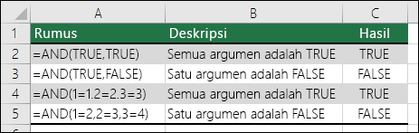

# Fungsi AND

### Pengertian

Menggunakan fungsi `AND`, salah satu fungsi logika, untuk menentukan apakah semua kondisi dalam sebuah tes adalah `TRUE`atau `FALSE`.

### Contoh



#### Penjelasan

Fungsi **`AND`** mengembalikan `TRUE`jika semua argumennya mengevaluasi ke `TRUE`, dan mengembalikan `FALSE` jika satu atau beberapa argumen mengevaluasi ke `FALSE`.

Satu penggunaan umum untuk fungsi **`AND`**adalah untuk memperluas penggunaan fungsi-fungsi lain yang melakukan uji logika. Misalnya, fungsi **`IF`** melakukan uji logika lalu mengembalikan satu nilai jika uji tersebut mengevaluasi ke `TRUE` dan nilai lain jika uji mengevaluasi ke `FALSE`. Dengan menggunakan fungsi **`AND`** sebagai argumen **`logical_tes`**dari fungsi **`IF`**, Anda dapat menguji banyak kondisi berbeda dan bukan hanya satu.

### **Sintaks**

```text
AND(logika1, [logika2], ...)
```

Sintaks fungsi **`AND`** memiliki argumen berikut:

| **Argumen** | **Deskripsi** |
| :--- | :--- |
| **`Logika1`** | Diperlukan. Kondisi pertama yang ingin Anda uji dan dapat mengevaluasi ke `TRUE` maupun `FALSE`. |
| **`Logika2`, ...** | Opsional. Kondisi tambahan yang ingin Anda uji yang mengevaluasi ke `TRUE` atau `FALSE`, hingga maksimal 255 kondisi. |


### **Keterangan**

* Argumen harus mengevaluasi ke nilai logika, seperti `TRUE` atau `FALSE`, atau argumen harus berupa array atau referensi yang berisi nilai-nilai logika.
* Jika array atau argumen referensi berisi teks atau sel kosong, nilai-nilai itu diabaikan.
* Jika rentang yang ditentukan tidak berisi nilai logika, fungsi **`AND`** akan mengembalikan kesalahan `#VALUE!`.




